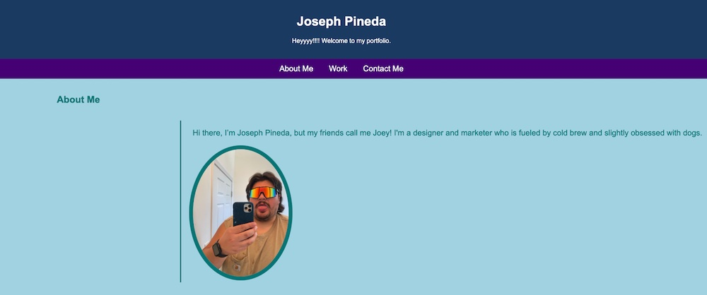
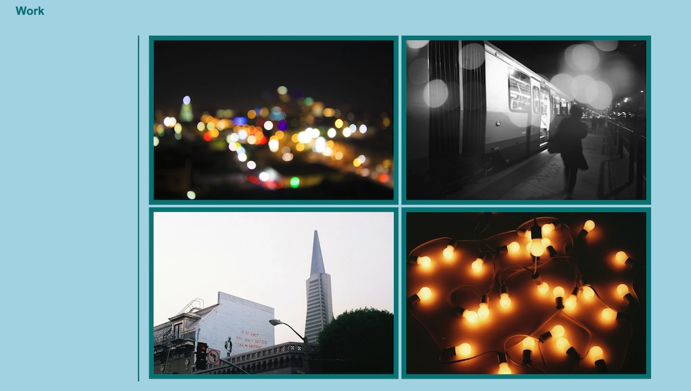

# professionalportfolio

## In order to create my portfolio, I recalled on the knowledge I learned from class, but as our INSTRUCTORS HIGHLY ENCOURAGE US, I also relied on Google and the W3 Schools website to try some code/experiment with some features such as the gradient over hover photos, and scaling over hover on photos.

## To create the responsive header and navigation bar, I referenced one of our student assignements from class on media queries.

## Below is a screenshot of my work!

## All photos are my property as well.

